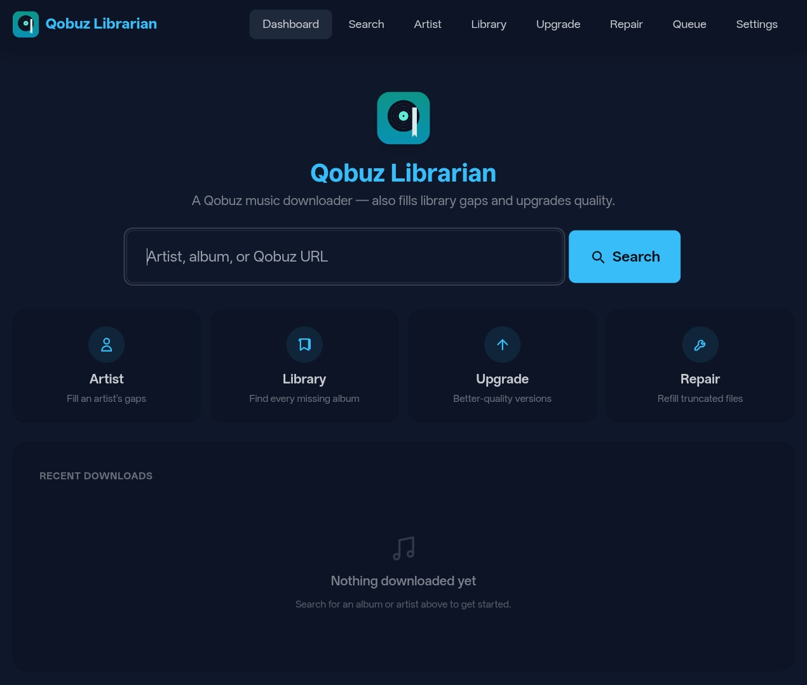

<p align="center">
  
</p>

<p align="center"><em>Your Qobuz library, at full quality — and kept tidy.</em></p>

<p align="center">
  <a href="https://github.com/jarynclouatre/qobuz-librarian/actions/workflows/test.yml"></a>
  <a href="https://github.com/jarynclouatre/qobuz-librarian/actions/workflows/docker.yml"></a>
  <a href="LICENSE"></a>
  
</p>

Qobuz Librarian downloads music from Qobuz — single albums, a whole artist
catalog, or a sweep of your entire library — and imports it cleanly with
[beets](https://beets.io/). It uses [streamrip](https://github.com/nathom/streamrip)
for the downloads and adds the part that's actually tedious by hand: knowing
what you already have so it only fetches what's missing. It runs from a web UI
or the CLI.

<p align="center">
  
</p>

By default it pulls the **best master your subscription serves** — 24-bit hi-res
up to 192 kHz where Qobuz has it, CD-quality lossless where it doesn't. That's
the point of a Qobuz subscription, so that's the default. Want smaller files
instead? Drop the quality to CD lossless or 320 kbps with one setting (see
[Download quality](#download-quality)). Your library, your call — the tool
doesn't decide for you.

## Features

**Get music, without re-downloading what you own.** Point it at an album,
an artist, or your whole library and it fills the gaps. It compares Qobuz
against your files with a four-layer match so it won't grab duplicates of
tracks you already have under slightly different names:

1. ISRC (exact recording identity)
2. MusicBrainz track ID
3. disc number + title
4. edition-stripped title (so "(Remastered)" / "(Deluxe)" don't cause dupes)

**Best-quality by default.** New downloads come in at the highest master
Qobuz offers for that release. Already have an album in a lower quality? The
**Upgrade** mode finds everything Qobuz can now serve better and re-rips just
those — backing the originals up first.

**Clean import.** beets handles tagging and cover art; files land in your
library in one move so a scanner never sees a half-processed state. Synced
lyrics are fetched automatically (when `LYRICS_ENABLED` is on; default).

**Library maintenance.**

- Consolidates duplicate / sibling album folders into one canonical directory
- Handles multi-artist and "Various Artists" directory layouts
- Edition- and decoration-aware album-name matching and version dedup
- ISRC-anchored repair: finds truncated or short FLACs and refills the exact
  missing tracks, leaving good files untouched

**Queue and safety.**

- Crash-safe persistent download queue that resumes after a restart
- Per-run lock so two instances can't fight over the same library
- Gap-fill never deletes a track; the only mode that replaces files
  (Upgrade) backs them up first

## How it ships

**Web UI, with a CLI for power users.** The web UI is the primary way to use
it (see below). The CLI runs the exact same engine and is handy for scripting
and unattended runs.

**The bundled tools stay yours.** streamrip and beets are seeded with sensible
defaults and then left alone — their full config files live in a persistent
volume and you can change anything they support. Qobuz Librarian wires them
together; it doesn't wall off what they can do.

**Single-container deploy.** streamrip, beets, and ffmpeg are bundled into one
image. Paths and ports come from environment variables; behaviour is set on
the Settings page (or via env defaults).

## How you use it

Most things follow the same shape: **scan → review → download.** A scan runs
in the background (live log streamed to the page), then parks with a checklist
of what it found. You tick what you want and approve; nothing is downloaded or
changed until you do.

| Page        | What it does                                                       |
|-------------|--------------------------------------------------------------------|
| **Search**  | Find an album by name or Qobuz URL and download it                  |
| **Artist**  | Scan one artist's discography, pick which missing albums to get     |
| **Library** | Scan every artist for missing albums across your whole library      |
| **Upgrade** | Find albums Qobuz can serve at higher quality, choose what to re-rip |
| **Repair**  | Find truncated/partial FLACs (ISRC-verified), choose what to refill |
| **Queue**   | Live progress, jobs awaiting review, and download history           |
| **Settings**| Qobuz credentials and behaviour toggles (applied without a restart) |

The CLI runs the same engine. Launch with no arguments for an
interactive menu (Album · Artist · three Library-walk variants ·
Repair · Upgrade), or pass flags for unattended runs — `--help` lists
them all.

### Download quality

A fresh install downloads at quality `4` — the best master Qobuz serves for
each release (24-bit up to 192 kHz, falling back to CD-quality lossless when
that's all a release has). All four streamrip tiers are available:

| Tier | What you get                     | Good for                          |
|------|----------------------------------|-----------------------------------|
| `4`  | 24-bit ≤192 kHz (best master)    | **Default.** Archival, best source |
| `3`  | 24-bit ≤96 kHz                   | Hi-res with a tighter size cap     |
| `2`  | CD-quality 16-bit / 44.1 kHz     | Smaller files, still lossless      |
| `1`  | 320 kbps lossy                   | Smallest, lossy                    |

Change it on the **Settings** page (live, no restart) or via
`STREAMRIP_QUALITY` in `compose.yaml`. To keep hi-res but not at full size,
see [Compression](#optional-power-features) — pull the best master, then
downsample on import.

### Quality upgrades

Upgrading existing files is its own **deliberate mode**, not something that
happens to your library in the background. A plain gap-fill only fetches the
tracks you're missing — it never wipes and re-downloads an album you have.

- **Upgrade walk** is its own mode (CLI and web). Running it *is* the opt-in:
  it scans for albums Qobuz can serve at higher quality, backs up the
  originals first (with retention cleanup), and won't replace an album if
  that would drop bonus or extra tracks you have.
- `AUTO_UPGRADE_ENABLED` (default off) only controls whether **ordinary
  gap-fill walks** also offer upgrades along the way. Off, walks just fill
  gaps; on, upgrades are surfaced during normal runs too. Either is fine —
  it's a workflow preference, not a safety setting.

### Optional power features

Off by default because they change your files:

- **Compression** (`COMPRESS_ENABLED`): downsample high-sample-rate FLACs
  (88.2/176.4/352.8 kHz → 44.1, 96/192/384 kHz → 48; bit depth preserved) on
  import. Pairs with the hi-res default: grab the best master, then store
  it at a sane sample rate. Still lossless FLAC; originals are replaced
  atomically, so an interrupt can't corrupt a track.

## Quick start (Docker)

streamrip and beets are bundled into the image, so there are no extra
containers to run.

```bash
mkdir qobuz-librarian && cd qobuz-librarian
curl -O https://raw.githubusercontent.com/jarynclouatre/qobuz-librarian/main/compose.yaml
curl -O https://raw.githubusercontent.com/jarynclouatre/qobuz-librarian/main/.env.example
cp .env.example .env
# edit .env — at minimum point QF_MUSIC_DIR at your music folder
# (see Configuration below for the full list of variables)
docker compose up -d
```

On Windows, run those commands in WSL or Git Bash — Windows PowerShell's
`curl` is an alias for `Invoke-WebRequest` with different flags, and
`cp`/`mkdir` chained with `&&` won't work the same way.

`compose.yaml` pulls the prebuilt image from Docker Hub. `latest` tracks
`main`; pin a tag like `0.1.0` in `compose.yaml` if you want a stable
build. See [Building from source](#building-from-source) below if you'd
rather build it yourself.

**Docker Desktop (Windows / macOS):** volume paths in `compose.yaml` are
relative to the file's location on the host. On Windows the host-side path
uses backslash notation, but the container path (e.g. `/music`) stays
Linux-style — Docker Desktop translates between them automatically.

Open <http://localhost:8666>. On first run the dashboard prompts you to add
your Qobuz credentials — do that on the **Settings** page (or set them in
`.env` before starting).

From there:

1. Open **Settings**, paste your `user_auth_token`, click **Test**, then **Save**.
2. Use the search bar on the dashboard to find an album.
3. Click **Download** — the job page streams the live log as it imports.

### Qobuz credentials

Auth is by **token**, not your password (it's the `password_or_token` field
streamrip uses). You need a paid Qobuz account; this only downloads what your
subscription already entitles you to. To get the token:

- **Qobuz desktop app** → Help → Debug → copy `user_auth_token`, or
- if you already use streamrip outside Docker, copy `password_or_token`
  from `~/.config/streamrip/config.toml` on your host.

Paste it into the Auth Token field on the Settings page; "User ID / Email"
takes either your account email or the numeric Qobuz user id. Credentials
stay in the container's config volume and are never sent anywhere but Qobuz.

### Building from source

```bash
git clone https://github.com/jarynclouatre/qobuz-librarian.git
cd qobuz-librarian
cp .env.example .env
docker compose -f compose.yaml -f compose.dev.yaml up -d --build
```

On Windows, run those commands in WSL or Git Bash.

### Configuration

Host paths and the web port are read from a gitignored `.env` file. Copy
`.env.example` to `.env` and edit these values:

| Variable             | Default             | Purpose                                |
|----------------------|---------------------|----------------------------------------|
| `QF_MUSIC_DIR`       | `./music`           | Music library; beets imports into this |
| `QF_STAGING_DIR`     | `./staging`         | Scratch space for in-progress downloads|
| `QF_UPGRADE_BACKUPS` | `./upgrade_backups` | Backups taken before a quality upgrade  |
| `WEB_PORT`           | `8666`              | Host port for the web UI               |

These four variables are read by Docker Compose on the **host** — they set
the mount sources. `compose.yaml` maps them to the container-side names
(`MUSIC_ROOT`, `STAGING_DIR`, etc.) the app reads.

Behaviour toggles (prefer hi-res master selection, consolidate folders,
multi-artist migration, upgrades-during-walks, compression) can be changed
live on the **Settings** page — no restart — or set as defaults in
`compose.yaml`. Tuning knobs (search limits, timeouts, fuzzy-match
thresholds) are environment variables in `compose.yaml`; each ships with a
working default you can override.

Advanced thresholds (fuzzy-match cutoffs, retention windows,
`POST_JOB_HOOK`) live in the `compose.yaml` env block; see
`src/qobuz_fetch/config.py` for what each does. `POST_JOB_HOOK` runs your
command in a shell — only set it to a command you trust.

### Lyrics & download quality

| Variable             | Default  | Purpose                                          |
|----------------------|----------|--------------------------------------------------|
| `STREAMRIP_QUALITY`  | `4`      | 1=320k · 2=CD/16-bit · 3=24-bit ≤96kHz · 4=≤192kHz best master (Settings page too) |
| `LYRICS_ENABLED`     | `true`   | Fetch lyrics on import (toggle on Settings page) |
| `LYRICS_FORMAT`      | `embed`  | `embed` (FLAC tag), `sidecar` (.lrc), or `both`  |
| `LYRICS_PROVIDERS`   | *(auto)* | Comma list, in order, e.g. `Lrclib,NetEase`      |

### beets & streamrip config

beets and streamrip are bundled, but the tools are still fully yours. Their
complete config files live in the persistent `config` volume, are seeded once
with sensible defaults, and are **never overwritten** — anything those
projects support, you can set:

- `…/beets/config.yaml` — tagging, paths, plugins ([beets docs](https://beets.readthedocs.io/))
- `…/streamrip/config.toml` — downloader settings ([streamrip docs](https://github.com/nathom/streamrip))

For folder/file naming without hand-editing YAML, uncomment and fill in
`BEETS_PATH_DEFAULT` / `BEETS_PATH_SINGLETON` / `BEETS_PATH_COMP` in
`compose.yaml` — the lines are already there, just remove the leading `#`
(beets path syntax, e.g. `$albumartist/$album ($year)/$track - $title`).

Plugins are also overridable via `BEETS_PLUGINS` (comma list) in
`compose.yaml` or the Settings page — e.g. `fetchart,lastgenre,replaygain`.
The default seeded config enables only `fetchart`. Plugins that need
their own config block (lastgenre API key, replaygain backend, etc.) still
require an edit to `/config/beets/config.yaml`; the env var only controls
which plugins are loaded.

## Pointing it at an existing library

The defaults assume a fresh library. For a collection that's already
beets-managed (or just well-organised), the layout and migration notes are
below.

### Expected folder layout

The scanner expects a **two-level tree** — `$MUSIC_ROOT/<Artist>/<Album>/`:

```
$MUSIC_ROOT/
├── Artist Name/
│   ├── Album Name/
│   │   └── 01 - Track.flac
│   └── Album (2017)/
│       ├── CD1/
│       └── CD2/
└── Other Artist/
    └── 2017 - Album/
        └── 01 - Track.flac
```

The album folder *name* is flexible — `Album`, `Album (2017)`,
`Album [2017]`, `2017 - Album` all work; a year in the name is used when
present but isn't required, since presence matching is driven by the
track tags, not folder names. Per-disc subdirs (`CD1/`, `CD2/`) are
recursed into. Most beets path templates work as-is, as long as the
result is artist-then-album.

Hidden directories (`startswith(".")`) and the staging dir are skipped.
Layouts it won't detect: flat (`/music/<track>.flac`) or extra-nested
(`/music/<Genre>/<Artist>/…`, `/music/<Artist>/<Year>/<Album>/…`) — anything
that isn't exactly artist directory, then album directory. Set
`QF_MUSIC_DIR` in your `.env` to point at the artist-level directory on
the host.

## Bringing your existing beets database

The container creates `/config/beets/musiclibrary.db` fresh on first start
if none exists. To use your existing beets database instead:

1. Stop the container if it's running.
2. Copy your DB and config into the `qobuz-librarian-config` volume:
   ```bash
   docker run --rm -v qobuz-librarian-config:/dest -v /your/beets/dir:/src alpine \
     sh -c 'mkdir -p /dest/beets && cp /src/config.yaml /dest/beets/ && \
            cp /src/library.db /dest/beets/musiclibrary.db'
   ```
   Replace `library.db` with your actual database filename. If you're not
   sure of the name, check the `library:` path in your beets `config.yaml`.
   The container expects the DB at `/config/beets/musiclibrary.db`.

   (Or bind-mount a host directory at `/config/beets` in `compose.yaml`.)
3. Start the container. It will not overwrite either file.

## Default beets config

The seeded `beets/config.yaml` is conservative so it doesn't surprise you
on first import:

| Setting | Default | Why this default | When to change it |
|---------|---------|------------------|-------------------|
| `autotag` | `no` | Keeps Qobuz's tags; the downloader already produces tagged FLACs. | Turn on if you trust MusicBrainz over Qobuz for tagging, or want auto-cover-art beyond what Qobuz embeds. |
| `move` | `yes` | Files leave staging and land in `MUSIC_ROOT` cleanly. | Switch to `copy` if `/music` and `/staging` are on different filesystems and you want to keep the staging copy. |
| `duplicate_action` | `merge` | Gap-fill merges new tracks into an existing album folder. | Use `skip` to skip anything that collides; `keep` to keep both copies on disk. |
| `incremental` | `no` | Always rescans staging so a retry sees the same files. | Turn on to skip already-seen staging dirs. |

Edit `/config/beets/config.yaml` and the changes apply on the next import
— no restart needed. beets path templates (folder/file naming) can also
be set via `BEETS_PATH_DEFAULT` / `_SINGLETON` / `_COMP` in `compose.yaml`
without editing YAML.

## First scan on a big library

A library-wide scan does one Qobuz API call per artist directory, with a
small pause between calls (`ARTIST_API_DELAY`, default 0.4 s). ~2000
artists is roughly 13 minutes before the review screen opens. Library
walks log progress line by line; nothing is downloaded until you approve
the review. It's a scan-once-then-review flow rather than a daemon — re-run
it whenever you've added music, not on a schedule.

Singles and very short EPs are hidden from the missing-albums step by
default — bump `MISSING_ALBUMS_MIN_TRACKS` in `compose.yaml` (or pass
`--include-singles` on the CLI) if you want them surfaced.

## What it will and won't touch on its own

- It **never** deletes a track during gap-fill. A bare gap-fill only adds
  missing tracks; the Upgrade walk is the only path that replaces files,
  and it backs them up first (see `UPGRADE_BACKUP_RETENTION_DAYS`).
- Consolidation (merging sibling/duplicate album folders) is **CLI-only**
  and **off by default**. It needs per-folder confirmation, which the CLI
  prompts for; the web UI has no review screen for it, so web downloads
  always skip consolidation regardless of `CONSOLIDATE`. Run a `cli`
  command (and set `CONSOLIDATE=true`) if you want it.
- `MIGRATE_MULTI_ARTIST` is off by default. With it on, after import a
  folder named `Primary Artist, Other Artist/Album` is moved into
  `Primary Artist/Album`. Off keeps your paths stable across scans.

## Running on a NAS

By default the container runs as root, so downloaded files are root-owned.
On a NAS, uncomment the `PUID`/`PGID` lines already in `compose.yaml` and
set them to the user that owns your media share so files are created with
the right ownership:

```yaml
# already in compose.yaml, just uncomment:
PUID: "${PUID:-1000}"
PGID: "${PGID:-1000}"
```

Then set `PUID=1000` / `PGID=1000` in your `.env` (or whatever values
your host uses). Find them with `id -u` / `id -g` — 1000 is typical for
desktop Linux but Synology/TrueNAS/QNAP differ.

The app drops to that user at startup and warns in the logs if a mounted
path isn't writable by it. Only the small `config`/`data` volumes are
chowned automatically; grant your media-share user write access on the NAS
side for `/music` and `/staging`. If your music share is read-only on the
NAS, append `:ro` to the `/music` bind in `compose.yaml` — the app will
refuse to mutate but scans and upgrade detection still work.

If the bind dirs already exist (typical: Compose auto-created them as root
on first `up`), `chown` them to your `PUID`/`PGID` before enabling those
settings, or you'll see the "volume not writable" warning every boot:

```bash
sudo chown -R 1000:1000 ./music ./staging ./upgrade_backups
```

## Using the CLI

The CLI runs inside the same container as the web UI — no separate install.
Stop the web container before running these (only one writer holds the
lock): `docker compose stop qobuz-librarian`, run the CLI, then
`docker compose start qobuz-librarian` afterward.

For an interactive menu:

```bash
docker compose run --rm qobuz-librarian cli
```

A few common unattended forms:

```bash
# Download a specific album (URL or "Artist Album" string)
docker compose run --rm qobuz-librarian cli https://open.qobuz.com/album/abcd1234

# Work through one artist's catalog
docker compose run --rm qobuz-librarian cli --artist "Stars of the Lid"

# Sweep every artist for quality upgrades, auto-confirming the safe ones
docker compose run --rm qobuz-librarian cli --upgrade-walk --auto-safe

# Full flag reference
docker compose run --rm qobuz-librarian cli --help
```

The CLI honours the same `.env` and `compose.yaml` settings as the web UI.

## Troubleshooting

| Symptom | Likely cause / next step |
|---------|--------------------------|
| `Another Qobuz Librarian run is in progress` | Web container holds the lock — use the web UI, or `docker compose stop qobuz-librarian` for CLI. |
| `MUSIC_ROOT missing or inaccessible` | Bind mount unset or wrong path — check `QF_MUSIC_DIR` in `.env` and that the host path exists. |
| Container exits immediately on `docker compose up` | `.env` missing from the compose dir, or a required `QF_*` var is unset. `docker compose logs qobuz-librarian` shows which. |
| `Volume not writable` (Settings → Diagnostics shows FAIL) | `PUID`/`PGID` don't match the host owner of the bind mount — `chown -R $(id -u):$(id -g) ./music ./staging` or set `PUID`/`PGID` in `.env`. |
| Web UI loads but Library scan says "no artist folders found" | `/music` is mounted at an empty directory or one level off — make sure `QF_MUSIC_DIR` points at the artist-level folder, not the parent. |
| Token rejected (Settings → Test) | Token expired, copied with surrounding quotes, or pasted with trailing whitespace — re-grab from the Qobuz desktop app → Help → Debug, paste clean. |
| Download stalls in "Importing into beets…" | A beets plugin is loaded without its required config block (e.g. lastgenre API key, replaygain backend). Disable it via `BEETS_PLUGINS` or add the block to `/config/beets/config.yaml`. |
| `docker compose pull` 404 | Image hasn't been published under that tag yet — build from source (see [Building from source](#building-from-source)). |
| Healthcheck failing but port reachable | Container couldn't reach its own `/healthz` — check container resource limits and `docker logs qobuz-librarian`. |
| Upgrade walk fails with `Permission denied` backing up an album | An earlier `docker exec qobuz-librarian beet …` (or similar) ran as root, leaving root-owned files the librarian (PUID 1000) can't move. Either rerun with `docker exec --user 1000:1000 …`, or fix on the host: `sudo chown -R 1000:1000 ./music`. |

## Security & deployment shape

The bundled `compose.yaml` ships with sane hardening enabled — what you
get on a fresh `docker compose up -d`:

- `mem_limit: 1g`, `pids_limit: 256` — a runaway streamrip child can't
  exhaust host resources.
- `security_opt: ["no-new-privileges:true"]` — kernel blocks setuid
  escalation paths.
- `cap_drop: [ALL]` plus only `CHOWN, DAC_OVERRIDE, FOWNER, SETUID,
  SETGID` added back — exactly what gosu + the PUID/PGID handover need.
- Multi-arch image (`linux/amd64`, `linux/arm64`) — NAS users on
  Synology/QNAP arm64 get native builds.
- Persisted token files at `/config/streamrip/config.toml` and
  `/data/.qobuz_settings.json` land 0600.
- CSRF (double-submit cookie + constant-time compare), strict CSP
  (`frame-ancestors 'none'`, no `unsafe-eval`), HSTS on HTTPS only.
- `--no-server-header` plus a middleware strip — uvicorn isn't
  advertised in responses.
- `QF_CHECK_VOLUMES=1` at startup blocks write endpoints with 503 if
  `/staging` or `/music` aren't writable, so the container fails
  loudly on a wrong PUID/PGID instead of silently mis-owned files.

`--read-only` rootfs deployments work as long as you include
`--tmpfs /tmp` (default APP_HOME) or set `APP_HOME=/var/tmp` with
`--tmpfs /var/tmp`.

## Limitations

- **One library, one container.** The `/staging` dir is single-writer. The
  run-lock prevents the CLI and web container from clashing inside one
  compose stack, but two stacks against the same mount will collide.
- **Qobuz only.** This tool drives streamrip's Qobuz path specifically;
  Tidal/Deezer/SoundCloud aren't wired up here, even though streamrip
  itself can reach them. (Their config still lives in your `config.toml`
  if you use streamrip directly.)
- **No lossy transcoding output.** `COMPRESS_ENABLED` can downsample hi-res
  FLACs to 44.1/48 kHz before import (still FLAC); there's no path to MP3
  or other lossy formats.
- **English / Latin metadata matching is best.** Fuzzy matching uses
  case-fold + edit distance; CJK / right-to-left titles still work but
  the thresholds were tuned on Latin scripts. Edition-variant stripping
  and lyric-title normalisation use English keyword lists — non-Latin
  editions (e.g. "豪华版") are kept verbatim rather than stripped.
- **A library-wide scan is a one-Qobuz-call-per-artist sweep.** Several
  thousand artists takes minutes, not seconds — it's a review tool, not a
  real-time index.
- **PWA install / offline mode need HTTPS.** The service-worker API only
  activates on HTTPS or `localhost` — front the container with a
  TLS-terminating reverse proxy if you want to install it as an app.
- **Windows console:** the CLI uses `·` (U+00B7 middle-dot) for progress
  lines. Windows terminals without UTF-8 mode (`chcp 65001`) will show a
  replacement character instead. The tool otherwise runs fine under WSL.

## Development

```bash
python3 -m venv .venv
source .venv/bin/activate
pip install -e ".[test]"
python -m pytest -q
```

PowerShell activation is `.venv\Scripts\Activate.ps1` instead of `source`.

`ruff check src tests` runs in CI; keep it clean before opening a PR.
`scripts/smoke_test.sh` boots the container and exercises the main CLI
modes against a temp music dir — run it before tagging a release.
See [CONTRIBUTING.md](CONTRIBUTING.md) for the rest.

## Acknowledgements

Qobuz Librarian is the glue around several excellent open-source projects,
which are bundled into the Docker image:

- **[streamrip](https://github.com/nathom/streamrip)** (Nathaniel Adams) —
  the actual Qobuz downloader. GPL-3.0.
- **[beets](https://beets.io/)** ([github](https://github.com/beetbox/beets)) —
  tagging, cover art, and library organisation. MIT.
- **[mutagen](https://github.com/quodlibet/mutagen)** — audio metadata
  reading/writing. GPL-2.0-or-later.
- **[FFmpeg](https://ffmpeg.org/)** — audio probing and transcoding.
  LGPL/GPL depending on build.

Lyrics are sourced via [syncedlyrics](https://github.com/moehmeni/syncedlyrics)
(LRCLIB, NetEase, Musixmatch). The web UI uses
[FastAPI](https://fastapi.tiangolo.com/),
[htmx](https://htmx.org/), [Tailwind CSS](https://tailwindcss.com/) and
[daisyUI](https://daisyui.com/). Thanks to all of their maintainers.

## License

This project's own code is **MIT** — see [LICENSE](LICENSE).

The Docker image redistributes the third-party tools listed under
[Acknowledgements](#acknowledgements), each of which keeps its own license.
Notably **streamrip (GPL-3.0)** and **mutagen (GPL-2.0-or-later)** are
copyleft — if you redistribute the image or a derivative, review their
terms. Qobuz Librarian invokes streamrip as a separate program (subprocess),
not as a linked library; see each project for authoritative license text.
</content>
</invoke>
